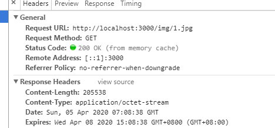
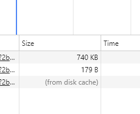
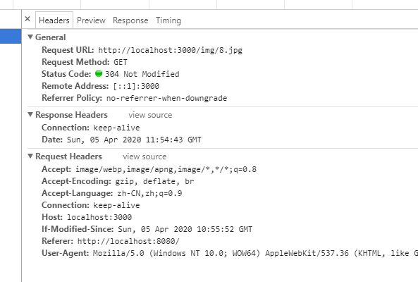

> 关于浏览器缓存方面的知识，也看了好几篇文章了。大家提到也总能说几个关键词出来，但是说到如何使用可能又不够确定了。为了方便自己和别人，在这通过实操记录下来，方便更好的理解和记忆。

首先，常说的浏览器缓存的两种情况`强缓存`和`协商缓存`，优先级较高的是强缓存，当强缓存命中失败时才会走协商缓存。

### 强缓存

强缓存是不需要发送http请求的，当资源命中强缓存时，直接从缓存中获取，响应状态返回200，打开控制台查看`Size`也不显示资源大小，而是告诉我们来自缓存。




> 强缓存如何实现呢，本文后端代码都通过Koa来演示

### 1、Expires

设置过期时间，第一次请求以后响应头中设置`Expires`
```js
router.get('/img/1.jpg', ctx => {
    const file = fs.readFileSync(path.resolve(__dirname,`.${ctx.request.path}`))
    ctx.set({
        'Expires': new Date((+new Date() + 1000*60*60*24*3))
    })
    ctx.body = file
})
```
将过期时间设置为三天后，这样在缓存未过期下就不需要再重新请求服务端了。但是`Expires`存在问题，就是客户端的时间和服务端时间可能是不一致的，比如你把电脑时间设置成三天甚至一年后，缓存就无效了。

### 2、Cache-Control
HTTP1.1新增了`Cache-Control`字段，Cache-Control优先级高于Expires，两者同时使用时会忽略Expires(Expires保留的作用是向下兼容)，Cache-Control字段属性值比较灵活。

#### 2.1 max-age
max-age指定资源的有效时间，单位是秒。以下是demo2，`Cache-controla:max-age=0`，同时设置Expires。测试可以看到图片始终不会缓存，也体现出了优先级的问题。
```js
// demo2
router.get('/img/2.jpg', ctx => {
    const file = fs.readFileSync(path.resolve(__dirname,`.${ctx.request.path}`))
    ctx.set({
        'Expires': new Date((+new Date() + 1000*60*60*24*3)),
        'Cache-control': 'max-age=0'
    })
    ctx.body = file
})
```
再测试demo3，这样图片的缓存时间就是10秒
```js
// demo3
router.get('/img/3.jpg', ctx => {
    const file = fs.readFileSync(path.resolve(__dirname,`.${ctx.request.path}`))
    ctx.set({
        'Cache-control': 'max-age=10'
    })
    ctx.body = file
})
```

#### 2.2 s-maxage
`s-maxage`和`max-age`类似，不同的地方`s-maxage`是针对代理服务器的
```js
// demo4
router.get('/img/4.jpg', ctx => {
    const file = fs.readFileSync(path.resolve(__dirname,`.${ctx.request.path}`))
    ctx.set({
        'Expires': new Date((+new Date() + 1000*60*60*24*3)),
        'Cache-control': 's-maxage=10'
    })
    ctx.body = file
})
```
测试发现图片无法缓存

#### 2.3 private和public
和前面两个属性相关，`private`对应资源可以被浏览器缓存，`public`表示资源既可以被浏览器缓存，也可以被代理服务器缓存。
默认值是`private`，相当于设置了`max-age`的情况；当设置了`s-maxage`属性，就表示可以被代理服务器缓存。

这里请看demo5
```js
// demo5
router.get('/img/5.jpg', ctx => {
    const file = fs.readFileSync(path.resolve(__dirname,`.${ctx.request.path}`))
    ctx.set({
        'Cache-control': 'private'
    })
    ctx.body = file
})
```
测试发现图片始终不会缓存，所以`private`对应`max-age`的默认值应该是0。但是private真的和max-age=0完全相同吗，我又写了个栗子测试。

```js
//demo6
router.get('/img/6.jpg', ctx => {
    const file = fs.readFileSync(path.resolve(__dirname,`.${ctx.request.path}`))
    ctx.set({
        'Expires': new Date((+new Date() + 1000*60*60*24*3)),
        'Cache-control': 'private'
    })
    ctx.body = file
})
```
测试发现图片会被缓存，说明`private`情况下，不会让`Expires`失效。

#### 2.4 no-store和no-cache

`no-store`比较暴力，不适用任何缓存机制，直接向服务器发起请求，下载完整资源。

`no-cache`跳过强缓存，也就是`Expires`、`max-age`等都无效了，直接请求服务器，确认资源是否过期，也就是进入协商缓存的阶段。协商缓存中有两个关键字段，`Last-Modified`和`Etag`

## 协商缓存

### 1、Last-Modified和If-Modified-Since
请看demo8
```js
// demo8
router.get('/img/8.jpg', ctx => {
    const file = fs.readFileSync(path.resolve(__dirname,`.${ctx.request.path}`))
    const stats = fs.statSync(path.resolve(__dirname,`.${ctx.request.path}`))
    if(ctx.request.header['if-modified-since'] === stats.mtime.toUTCString()){
        return ctx.status = 304
    }
    ctx.set({
        'Cache-control': 'no-cache',
        'Last-Modified': stats.mtime.toUTCString()
    })
    ctx.body = file
})
```
第一次请求后，在响应头中加入`Last-Modified`字段，返回资源的最后修改时间，下次请求时客户端请求头会带上`If-Modified-Since`的字段，里面的值就是之前响应头中`Last-Modified`的值，然后进行比较，如果没有变化，则返回304的状态码。

如果改造一下把`'Cache-control': 'no-cache'`去掉呢，测试后发现，在不清缓存的情况资源就变成强缓存了，请求头中的`If-Modified-Since`也没有了(加上也没用，因为不会发送http请求)，导致文件更新就无法检测了。
### 2、 ETag和If-None-Match
请看demo9
```js
// demo9
router.get('/img/9.jpg', ctx => {
    const file = fs.readFileSync(path.resolve(__dirname,`.${ctx.request.path}`))
    const stats = fs.statSync(path.resolve(__dirname,`.${ctx.request.path}`))
    if(ctx.request.header['if-none-match']){
        if(ctx.request.header['if-none-match'] === 'abc123'){
            return ctx.status = 304
        }
    }else if(ctx.request.header['if-modified-since'] === stats.mtime.toUTCString()){
        return ctx.status = 304
    }
    ctx.set({
        'Cache-control': 'no-cache',
        'Last-Modified': stats.mtime.toUTCString(),
        'ETag': 'abc123'
    })
    ctx.body = file
})
```
和`Last-Modified`类似，第一次请求以后，响应头中会增加`ETag`字段，`ETag`通过资源的内容生成一个标识符，下次请求在请求中增加`If-None-Match`字段，值就是之前响应头中`ETag`的值，然后进行比较。`ETag`可以说是对`Last-Modified`的一个补充，因为`Last-Modified`也是有不足的地方。举个栗子，Last-Modified中的时间是精确到秒的，如果同一秒内文件被修改了一次，下一次请求时，预期获取新资源而实际还是会走协商缓存。而`ETag`是基于资源内容的，所以会生成新的值，因此能达到预期效果。

## 补充：浏览器缓存的四个位置
1. Service Worker Cache
2. Memory Cache
3. Disk Cache
4. Push Cache

`Service Worker Cache`，这个很多人都听过，是PWA应用的重要实现机制，推荐资源：[PWA应用实战](https://lavas-project.github.io/pwa-book/)。

`Memory Cache`和`Disk Cache`就是前面总结的，我们强缓存和协商缓存存放资源的位置。`Memory Cache`内存缓存，是效率最高的，当然内存资源也是昂贵的有限的，不可能都使用内存缓存，`Disk Cache`磁盘缓存，相对来说读取速度慢些。一般来说，大文件或者内存使用高的情况下，资源会被丢进磁盘。

`Push Cache`推送缓存，缓存的最后一道防线。是HTTP2中的内容，需要自行去了解。

### 总结几个点

1、协商缓存中有两组约定的字段，一是`Last-Modified`和`If-Modified-Since`；二是`ETag`和`If-None-Match`。也就是响应头中存在`Last-Modified`(或`ETag`)，则下次请求的响应头中会自动增加`If-Modified-Since`(或`If-None-Match`)字段，至于是否走协商缓存取决于具体代码，比如触发条件一般就是比较同一组数据是否相同，同时因为第二组更加准确，所以优先级也更高。

2、`Cache-Control: private`和`Cache-Control: max-age=0`，效果不完全相同，前者不会让`Expires`失效。

3、浏览器缓存机制总览，首先如果命中强缓存就直接使用；否则就进入协商缓存阶段，这里会产生http请求，通过协商缓存的两组规范，检查资源是否更新。没更新的话就返回304状态码，否则就重新获取资源并返回200状态码。

4、通过上面的演示可以看得出来，处理缓存的工作量主要在后端，然后在工作中，静态资源我们一般都是直接使用中间件来处理，比如笔者在Koa项目中的话，会用`koa-static`这个中间件。前端不需要写相关代码，后端用现成的轮子，因此缓存相关的知识就被抛弃了。